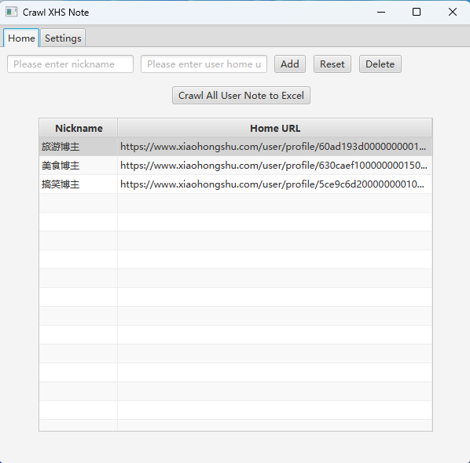

<div align="center">

<h1 align="center">
🕷️xiaohongshu
</h1>

</div>

> **Warning**

> The primary purpose of this repository is to learn. It is important to note that web crawling may
> be considered illegal, and therefore, it is crucial to refrain from exerting any pressure or engaging in unauthorized
> activities on websites.


# Introduction

[tanpenggood/xiaohongshu](https://github.com/tanpenggood/xiaohongshu) is a crawling application designed to extract data from [xiaohongshu](https://www.xiaohongshu.com/explore) page.

**crawling data range**: only parsed data in `window.__INITIAL_STATE__` of xiaohongshu page.

# Development Environment

- windows 11
- jdk 1.8
- maven 3.6.0

# Useage

## Use UI

Run `com.itplh.xhs.XhsCrawlabUI`

See:



## Use API

- crawl notes

  reference test class: `com.itplh.xhs.XhsCrawlabTest`
  
  https://github.com/tanpenggood/xiaohongshu/blob/075cdda85116e1039836ad7ec59c28ea6daebba1/src/test/java/com/itplh/xhs/XhsCrawlabTest.java#L9-L21

- save note to excel

  `com.itplh.xhs.excel.ExcelGenerator.writeNotes2Excel(UserInfo userInfo)`

# Project Structure

```
xiaohongshu
├── src/main
│   ├── java/com.itplh.xhs       
│   │   ├── constant
│   │   ├── domain
│   │   ├── excel            # generate excel, use easyexcel
│   │   ├── parse            # parse json data (parse window.__INITIAL_STATE__)
│   │   ├── ui               # build ui, use javafx    
│   │   ├── util               
│   │   ├── XhsCrawlab       # core api   
│   │   └── XhsCrawlabUI     # ui
│   └── resources
│       ├── desktop          # response data of desktop access xiaohongshu
│       ├── mobile           # response data of mobile access xiaohongshu
│       └── logback.xml      # log config
├── src/test/java            # unit test
├── pom.xml
└── README.md
```

# Technology Stack

- Java:1.8
- [auto-browser-script-engine:1.1.2](https://github.com/tanpenggood/auto-browser-script-engine)
- jsoup:1.15.2
- fastjson2:2.0.15
- lombok:1.18.12
- logback-classic:1.2.3
- junit:4.13

# Build

```bash
mvn clean package -Dmaven.test.skip=true
```

# Download exe

[https://github.com/tanpenggood/xiaohongshu/releases](https://github.com/tanpenggood/xiaohongshu/releases)
